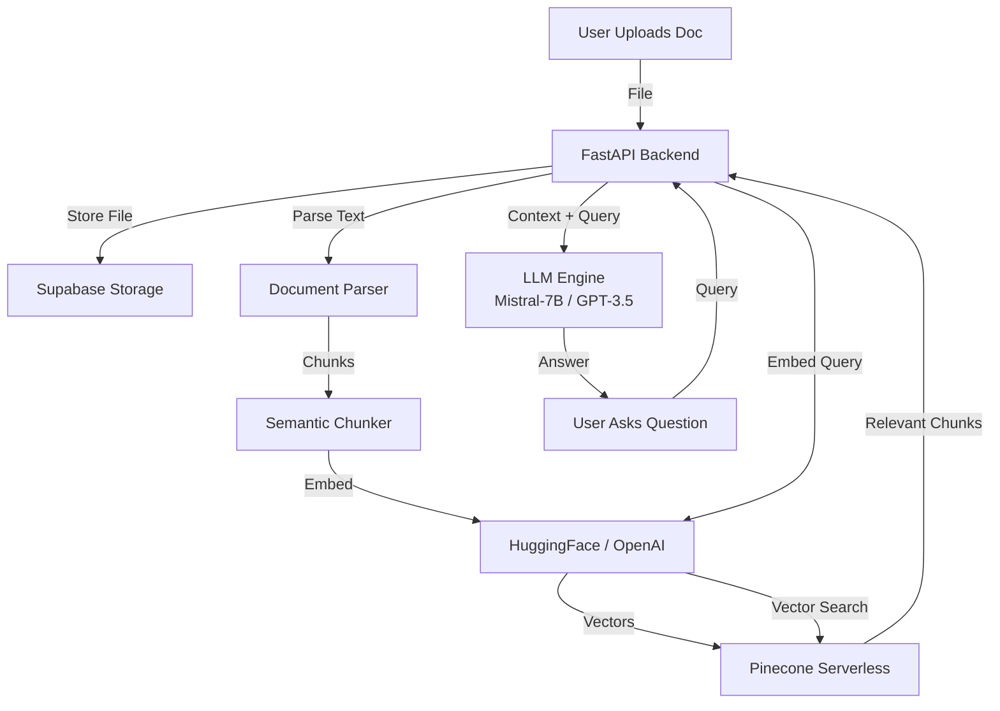

# 🧠 Aggroso.AI - Production RAG System

[](https://rag-doc.onrender.com/)
[](https://fastapi.tiangolo.com/)
[](https://www.pinecone.io/)
[](https://supabase.com/)

**Live Demo:** [https://rag-doc.onrender.com/](https://rag-doc.onrender.com/)

A production-ready **Retrieval Augmented Generation (RAG)** system capable of ingesting your documents (PDFs, Images, Text), understanding them via semantic search, and answering questions using state-of-the-art LLMs. Designed to be **model-agnostic**, supporting both OpenAI and open-source Hugging Face models (Free Tier compatible).

---

## 🏗️ Architecture

The system follows a modern RAG pipeline architecture:



### Key Components
1.  **Ingestion Engine**:
    *   **Supabase Storage**: Persists raw files (PDF, PNG, JPEG, TXT).
    *   **Universal Parser**: extracts text from PDFs and performs OCR on images.
2.  **Indexing Pipeline**:
    *   **Chunking**: Splits text into meaningful segments for optimal retrieval.
    *   **Embeddings**: Converts text to vectors using `sentence-transformers/all-MiniLM-L6-v2` (via Hugging Face API) or OpenAI `text-embedding-3-small`.
    *   **Vector Database**: Pinecone serverless index for sub-100ms similarity search.
3.  **Retrieval & Generation**:
    *   **Hybrid Search**: Uses purely semantic search combined with metadata filtering (e.g., scoping search to a specific document vs. global knowledge).
    *   **LLM Engine**: dynamic provider switching. Defaults to **Mistral-7B-Instruct** (Free) but can seamlessly switch to **GPT-3.5/4** if an API key is provided.

---

## 🚀 Features

*   **📄 Multi-Format Support**: Upload PDFs, Images (OCR), and text files.
*   **🤖 Universal LLM Support**: Runs 100% free using Hugging Face's Inference API, or use OpenAI for higher throughput.
*   **🔍 Smart Scoping**: The AI understands if you want to ask about *all* your documents or just the *current* one.
*   **☁️ Cloud Native**: Built for serverless deployment (Render + Pinecone + Supabase).
*   **🛡️ Robust Error Handling**: Automatic retries and fallbacks for API failures.

---

## 🛠️ Tech Stack

*   **Backend**: Python, FastAPI, Uvicorn
*   **Frontend**: Vanilla JS, HTML5, CSS3 (Glassmorphism UI)
*   **Database (Vector)**: Pinecone
*   **storage**: Supabase
*   **AI/ML**: LangChain (logic), Hugging Face Hub, OpenAI

---

## 🔧 Local Setup

1.  **Clone the repository**:
    ```bash
    git clone https://github.com/benadictjacob/rag-doc.git
    cd rag-doc
    ```

2.  **Install Dependencies**:
    Requires Python 3.11+
    ```bash
    pip install -r requirements.txt
    ```

3.  **Environment Variables**:
    Create a `.env` file based on `.env.example`:
    ```env
    # Required for Vector Search
    PINECONE_API_KEY=your_key
    PINECONE_INDEX=rag-app
    
    # Required for File Storage
    SUPABASE_URL=your_url
    SUPABASE_KEY=your_anon_key
    
    # Required for AI (Free)
    HF_API_KEY=your_huggingface_token
    
    # Optional (for GPT-3.5)
    OPENAI_API_KEY=sk-...
    ```

4.  **Run the Server**:
    ```bash
    uvicorn backend.main:app --reload
    ```
    Visit `http://localhost:8000`.

---

## 📦 Deployment

This project is configured for one-click deployment on **Render**.

1.  Push code to GitHub.
2.  Create a **Web Service** on Render.
3.  Set **Build Command**: `pip install -r requirements.txt`
4.  Set **Start Command**: `uvicorn backend.main:app --host 0.0.0.0 --port $PORT`
5.  Add your Environment Variables in the Render dashboard.

---

## License
MIT
